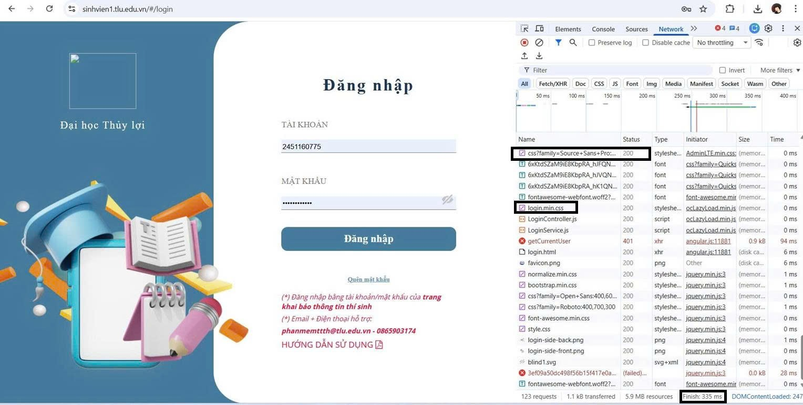
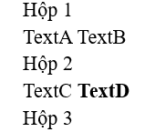
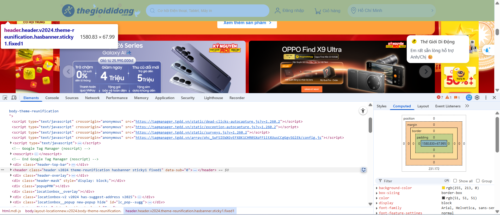
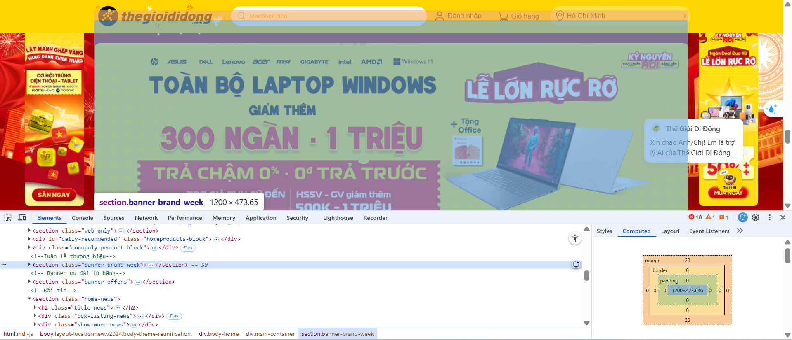
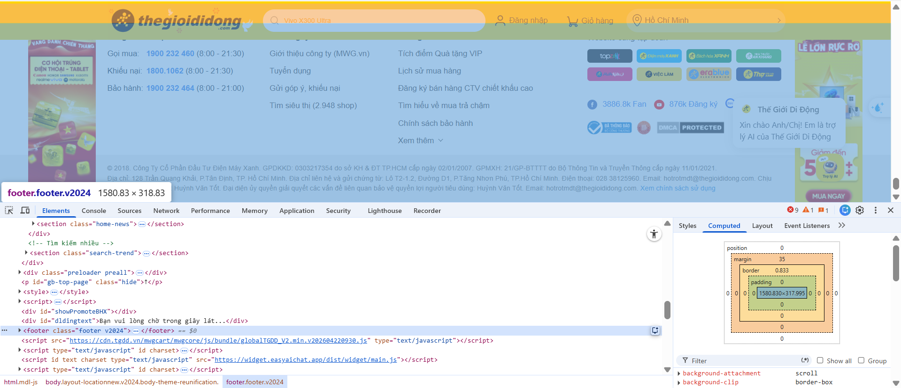
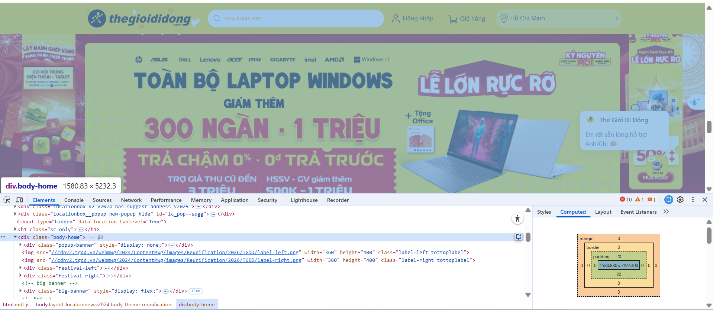
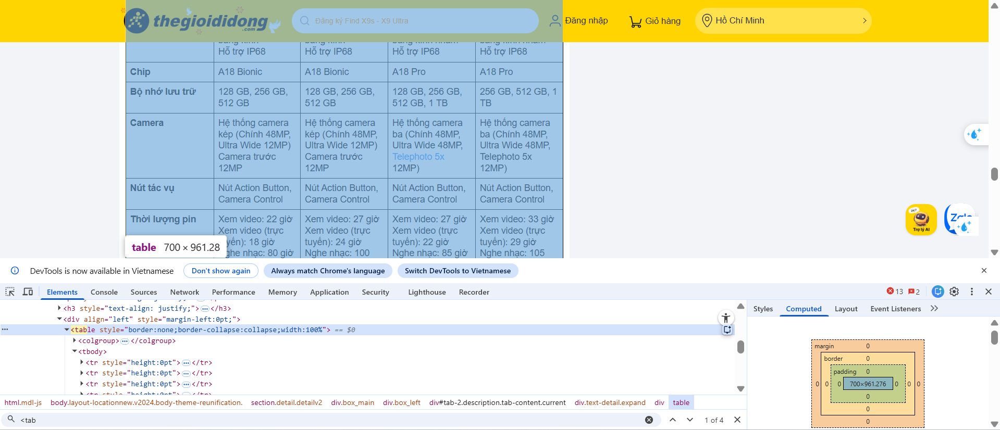
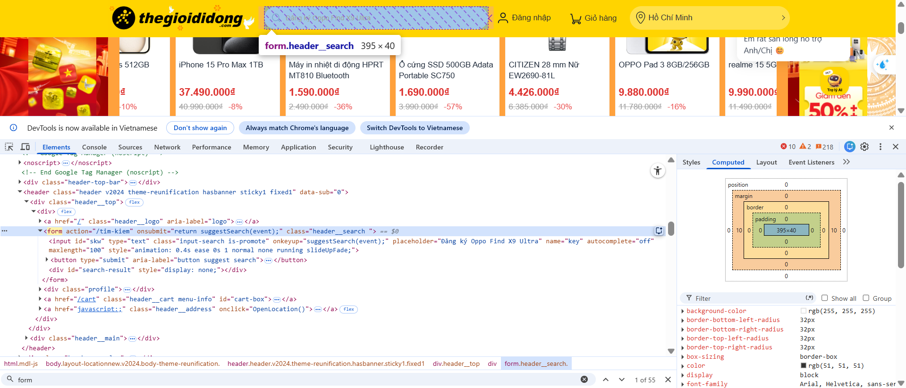

Câu A1:
1.
Khi nhập URL và nhấn Enter, trình duyệt thực hiện:
- DNS lookup để lấy IP
- Thiết lập TCP connection
- Thiết lập TLS (HTTPS)
- Gửi HTTP request
- Server trả HTTP response
- Trình duyệt parse HTML và render trang

2.
Tab Network cho thấy:

- Danh sách tất cả request (HTML, CSS, JS, ảnh…)
- Status code (200, 404…)
- Thời gian tải từng file
- Kích thước file
- Tổng thời gian load trang
- Header (request & response)



Câu A2:

1. Nguyên nhân SEO thấp:

Trang web bị đánh giá SEO thấp vì:
- Không sử dụng thẻ semantic HTML (header, nav, main, article, footer)
- Sử dụng quá nhiều thẻ div không có ý nghĩa ngữ nghĩa
- Không có thẻ tiêu đề (heading: h1, h2...)
- Ảnh không có thuộc tính alt

2. Các lỗi semantic:

Lỗi 1: Không dùng thẻ `<header>`
`<div class="header">`

→ Nên dùng `<header>` để mô tả phần đầu trang

Lỗi 2: Không dùng thẻ `<nav>` cho menu
`<div class="menu">`

→ Nên dùng `<nav>` để biểu thị thanh điều hướng

Lỗi 3: Không dùng heading cho tiêu đề
`<div class="title">iPhone 16 Pro</div>`

→ Nên dùng `<h1>` hoặc `<h2>`

Lỗi 4: Không dùng `<article>` cho sản phẩm
`<div class="product">`

→ Nội dung độc lập nên dùng `<article>`

Lỗi 5: Ảnh không có alt
``

→ Nên thêm alt để hỗ trợ SEO

Câu A3:
- Mô tả bằng hình ảnh kết quả hiển thị của đoạn HTML:   
- Giải thích:
    - Thẻ `<div>` là Block element, đặc tính của nó là chiếm CẢ DÒNG và tự động xuống dòng mới. Do đó, "Hộp 1", "Hộp 2", và "Hộp 3" sẽ đứng một mình trên các dòng riêng biệt.
    - Thẻ `<span>` và `<strong>` là Inline elements, đặc tính của chúng là chỉ chiếm khoảng không gian vừa đủ cho NỘI DUNG và nằm cùng dòng với nhau. Vì vậy, "Text A" và "Text B" sẽ nằm cạnh nhau trên một dòng; tương tự, "Text C" và "Text D" cũng sẽ nằm cạnh nhau trên một dòng.

Câu A4:

`<thead>` là phần đầu bảng (tiêu đề cột) `<tbody>` là phần thân bảng (dữ liệu chính) `<tfoot>` là phần chân bảng (tổng kết)

Lý do không nên dùng table để tạo layout trang web

Lý do 1 — Sai ngữ nghĩa (semantic) `<table>` sinh ra để hiển thị dữ liệu dạng bảng, không phải để chia cột layout. Google và screen reader hiểu `<table>` là "đây là bảng dữ liệu" — dùng sai mục đích làm SEO và accessibility kém đi.

Lý do 2 — Code phức tạp, khó bảo trì Layout bằng table phải lồng `<tr>`, `<td>` chằng chịt, rất khó đọc và sửa. Thêm một cột hay thay đổi bố cục là phải sửa rất nhiều chỗ.

Lý do 3 — Tải chậm hơn Trình duyệt phải đọc toàn bộ table trước khi render, vì cần biết kích thước tất cả các ô.

PHẦN B: THỰC HÀNH CODE

Câu B3:

# Danh sách lỗi và cách sửa

Lỗi 1: Dòng 1 — <!DOCTYPE> sai cú pháp — Sửa thành `<!DOCTYPE html>`

Lỗi 2: Dòng 2 — Thiếu thuộc tính lang — Thêm lang="vi" vào thẻ `<html>`

Lỗi 3: Dòng 4 — Thẻ `<title>` không đóng — Thêm `</title>`

Lỗi 4: Dòng 5 — charset sai (utf8) — Sửa thành UTF-8

Lỗi 5: Dòng 9 — Thẻ `<h1>` không đóng đúng — Sửa `</h1>`

Lỗi 6: Dòng 13 — Thẻ `<a>` không đóng — Thêm `</a>`

Lỗi 7: Dòng 20 — `` thiếu dấu ngoặc kép và alt — Sửa src="iphone.jpg" và thêm alt

Lỗi 8: Dòng 22 — Sai thứ tự đóng thẻ `<b>` — Sửa thành `<strong>...</strong>`

Lỗi 9: Dòng 18 — Dùng `<h3>` không hợp lý — Sửa thành `<h2>`

Lỗi 10: Dòng 27 — Bảng không có `<thead>`, `<tbody>` — Thêm cấu trúc semantic

Lỗi 11: Dòng 36 — Dùng 2 thẻ `<main>` — Sửa thẻ thứ 2 thành `<aside>`

Lỗi 12: Dòng 41 — Thẻ `<p>` trong footer không đóng — Thêm `</p>`

Lỗi 13: Link href="home", "products" không chuẩn — Sửa thành "#" hoặc đường dẫn hợp lệ

Câu B4:

Trong trang web thegioididong.com:
  1. 3 thẻ semantic HTML5 mà trang đó sử dụng
    - Thẻ `<header>`:
    
    - Thẻ `<section>`:
    
    - Thẻ `<footer>`:
    
    - Thẻ `<body>` mà trang đó KHÔNG dùng đúng semantic:
    
2. Thẻ `<table>` hiển thị chi tiết nội dung sản phẩm
    - 

3. Thẻ `<form>`:
   - 

Form có action là `<action="/tim-kiem">`. Khi submit, dữ liệu sẽ được gửi đến đường dẫn /tim-kiem

Không có method nên sẽ mặc định là GET

Input có 2 loại là text để nhập và button để click


PHẦN C: SUY LUẬN

Câu C1:
```html
<!DOCTYPE html>

<html lang="vi">
<head>
    <meta charset="UTF-8">
    <title>Chi tiết sản phẩm</title>
</head>
<body>

<!-- HEADER -->

<header> <!-- header: phần đầu trang -->
    <h1>ShopTLU</h1>

<nav> <!-- nav: điều hướng chính -->
    <a href="#">Trang chủ</a>
    <a href="#">Sản phẩm</a>
    <a href="#">Liên hệ</a>
</nav>

</header>

<!-- BREADCRUMB -->

<nav aria-label="breadcrumb"> <!-- nav: điều hướng breadcrumb -->
    <ol> <!-- ol: có thứ tự phân cấp -->
        <li><a href="#">Trang chủ</a></li>
        <li><a href="#">Điện thoại</a></li>
        <li>iPhone 16</li>
    </ol>
</nav>

<!-- MAIN CONTENT -->

<main> <!-- main: nội dung chính của trang -->

<!-- SECTION: SẢN PHẨM -->
<section> <!-- section: nhóm nội dung sản phẩm -->
    
    <!-- ARTICLE: CHI TIẾT SẢN PHẨM -->
    <article> <!-- article: nội dung độc lập -->
        
        <!-- HÌNH ẢNH -->
        <section> <!-- section: nhóm ảnh -->
            <h2>Hình ảnh sản phẩm</h2>
            
            <figure> <!-- figure: chứa ảnh -->
                
            </figure>
            <figure>
                
            </figure>
            <figure>
                
            </figure>
            <figure>
                
            </figure>
            <figure>
                
            </figure>
        </section>

        <!-- THÔNG TIN SẢN PHẨM -->
        <section> <!-- section: thông tin -->
            <h2>Thông tin sản phẩm</h2>
            
            <h3>Tên sản phẩm</h3> <!-- heading: tiêu đề -->
            <p>Giá: <strong>...</strong></p> <!-- strong: nhấn mạnh giá -->
            <p>Đánh giá: ⭐⭐⭐⭐⭐</p>
            <p>Mô tả ngắn sản phẩm...</p>
        </section>

        <!-- BẢNG THÔNG SỐ -->
        <section> <!-- section: thông số -->
            <h2>Thông số kỹ thuật</h2>
            
            <table> <!-- table: dữ liệu dạng bảng -->
                <thead> <!-- thead: tiêu đề bảng -->
                    <tr>
                        <th>Thông số</th>
                        <th>Giá trị</th>
                    </tr>
                </thead>
                <tbody> <!-- tbody: dữ liệu -->
                    <tr>
                        <td>CPU</td>
                        <td>...</td>
                    </tr>
                    <tr>
                        <td>RAM</td>
                        <td>...</td>
                    </tr>
                </tbody>
            </table>
        </section>

        <!-- ĐÁNH GIÁ -->
        <section> <!-- section: bình luận -->
            <h2>Đánh giá & Bình luận</h2>
            
            <article> <!-- article: mỗi bình luận độc lập -->
                <p>Người dùng A: Sản phẩm tốt</p>
            </article>
            
            <article>
                <p>Người dùng B: Đáng tiền</p>
            </article>
        </section>

    </article>
</section>

</main>

<!-- SIDEBAR -->

<aside> <!-- aside: nội dung phụ -->
    <h2>Sản phẩm tương tự</h2>

<article> <!-- article: mỗi sản phẩm -->
    <p>Sản phẩm 1</p>
</article>

<article>
    <p>Sản phẩm 2</p>
</article>

</aside>

<!-- FOOTER -->

<footer> <!-- footer: cuối trang -->
    <p>© 2026 ShopTLU</p>
</footer>

</body>
</html>
```

Câu C2:

Việc dùng `<div>` cho mọi thứ rồi chỉ thêm class là chưa hợp lý và có thể gây nhiều hạn chế. Thứ nhất, về **SEO**, các công cụ tìm kiếm như Google không chỉ đọc nội dung mà còn dựa vào cấu trúc HTML để hiểu trang web. Khi sử dụng các thẻ semantic như `<header>`, `<nav>`, `<main>`, `<article>`, nội dung sẽ được phân loại rõ ràng, giúp trang dễ được index và xếp hạng tốt hơn. Nếu toàn bộ đều là `<div>`, công cụ tìm kiếm khó xác định đâu là nội dung chính, đâu là điều hướng.

Thứ hai, về **Accessibility (khả năng truy cập)**, các công cụ hỗ trợ như screen reader dựa vào semantic HTML để giúp người khiếm thị sử dụng website. Ví dụ, họ có thể nhanh chóng chuyển đến phần nội dung chính (`<main>`) hoặc menu (`<nav>`). Nếu chỉ dùng `<div>`, trải nghiệm người dùng sẽ kém đi vì thiếu thông tin ngữ nghĩa.

Ví dụ cụ thể: thay vì viết `<div class="menu">...</div>`, việc dùng `<nav>...</nav>` sẽ giúp trình duyệt và công cụ tìm kiếm hiểu ngay đây là thanh điều hướng mà không cần suy đoán qua class.

Tuy nhiên, `<div>` vẫn phù hợp trong một số trường hợp, ví dụ như dùng làm phần bao (wrapper) để phục vụ việc bố cục (layout) bằng CSS như flexbox hoặc grid, khi phần tử đó không mang ý nghĩa nội dung cụ thể.

Tóm lại, semantic HTML giúp cải thiện SEO, tăng khả năng truy cập và làm cho code rõ ràng, dễ bảo trì hơn, nên không nên thay thế hoàn toàn bằng `<div>`.
